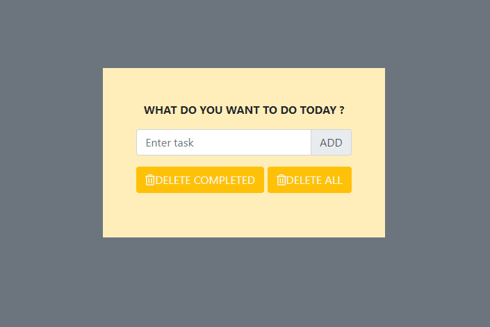
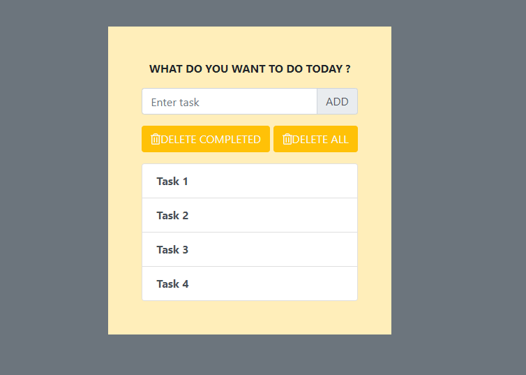
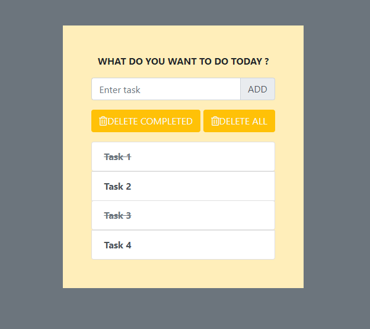
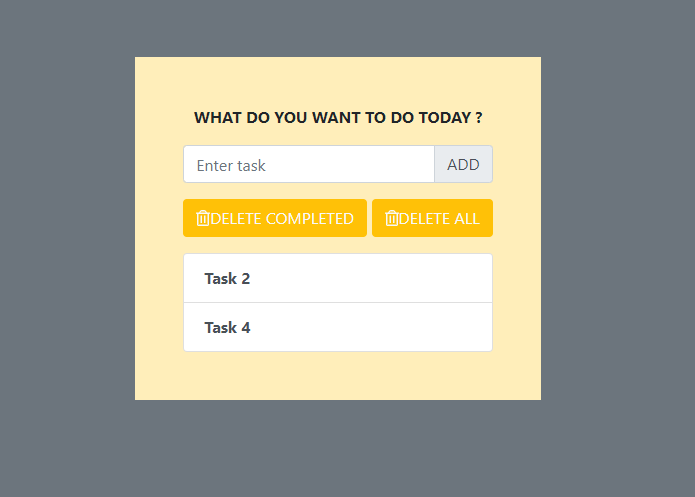

# Todo-App-django
CRUD operations in django along with @require_POST and other stuffs of static file handling

<h3>Initial Screen</h3>

<h3>After adding few items...</h3>

<h3>Just click on the task to mark it as completed</h3>

<h3>After clicking on 'Delete completed'...</h3>

<h3>Delete all button deletes all the tasks</h3>

